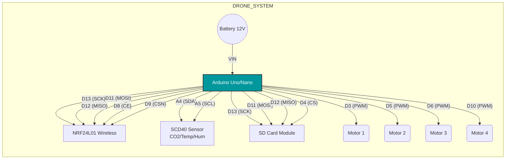
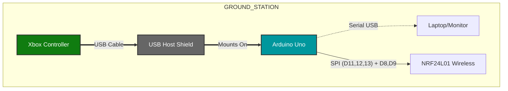

# Precision Agriculture Drone with Air Quality Monitoring

## 📖 Abstract
This project develops a drone-based monitoring system designed for real-time air quality monitoring in agricultural fields. The system utilizes an **SCD40 sensor** for $CO_2$, temperature, and humidity measurements, and employs an **NRF24L01 module** for wireless data transmission. Data is recorded on an SD card for offline analysis, facilitating better decision-making for resource management and crop health optimization.

## 👥 Team Members
**Institution:** VIT-AP University
**Guide:** Chandan Kumar Thakur

* **Nirup Koyilada** - 22BCE9005
* **Mukhesh Vadlamudi** - 22BCE8247
* **Sudhanshu Gollapilli** - 22BCE8020
* **Yashwant Patnaikuni** - 22BCE8269
* **Abhishek Anand** - 22BCE8461
* **Abhinay Vundavilli** - 22BCE8299

---

## 🛠️ Hardware & Tech Stack
The project consists of two main units: the **Drone (Receiver)** and the **Ground Station (Transmitter)**.

### Components Used
* **Microcontroller:** Arduino Uno (x2) / Arduino Nano
* **Sensors:** SCD40 ($CO_2$, Temperature, Humidity)
* **Communication:** NRF24L01 PA LNA Wireless Modules (x2)
* **Storage:** Micro SD Card Module
* **Control:** Xbox 360 Controller + USB Host Shield
* **Propulsion:** Brushless DC Motors (x4) + ESCs

### Software Libraries
* `RF24.h` (for NRF24L01)
* `SensirionI2CScd4x.h` (for SCD40)
* `SD.h` (for Data Logging)
* `XBOXUSB.h` (for Controller Input)

---

## 🔌 System Architecture & Wiring

### 1. Drone Wiring Diagram (Receiver)
The drone acts as the receiver. It listens for control signals from the ground while simultaneously reading sensor data and logging it to the SD card.

### 2. Ground Station Wiring Diagram (Transmitter)
The ground station uses a USB Host Shield to interface with an Xbox controller. It processes joystick inputs and transmits them via radio to the drone.

## 📊 Data Logging Format
The system automatically creates a file named `env_data.csv` on the SD card. The data is logged in the following structure:

| CO2 (ppm) | Temperature (°C) | Humidity (%RH) | Throttle | Yaw | Pitch | Roll |
| :--- | :--- | :--- | :--- | :--- | :--- | :--- |
| 450 | 28.5 | 60.2 | 120 | 0 | 5 | 2 |
| 455 | 28.6 | 60.1 | 125 | 0 | 4 | 1 |

## 🚀 Usage Instructions

1.  **Setup Hardware:** Assemble the drone and ground station according to the wiring diagrams above.
2.  **Library Installation:** Install the required libraries (`RF24`, `Sensirion I2C SCD4x`, `USB Host Shield 2.0`) via the Arduino IDE Library Manager.
3.  **Upload Code:**
    * Upload `Drone_Receiver_Code.ino` to the drone's Arduino.
    * Upload `Ground_Station_Code.ino` to the ground station's Arduino.
4.  **Power On:**
    * Power on the Ground Station first.
    * Power on the Drone (Battery).
5.  **Operation:**
    * The drone will initialize the SD card and sensors.
    * Use the **Right Trigger (RT)** on the Xbox controller to increase throttle.
    * Use the **Joysticks** to control Yaw, Pitch, and Roll.
6.  **Data Retrieval:** After the flight, remove the SD card and insert it into a computer to view the `env_data.csv` file.

## 🔮 Future Improvements
* **GPS Integration:** Adding a NEO-6M GPS module to geotag every air quality reading with precise location data.
* **Live Telemetry:** Upgrading the code to send sensor data back to the ground station screen in real-time for instant analysis.
* **NDVI Monitoring:** Integration of Near-Infrared sensors to calculate vegetation health indices for precision agriculture.
